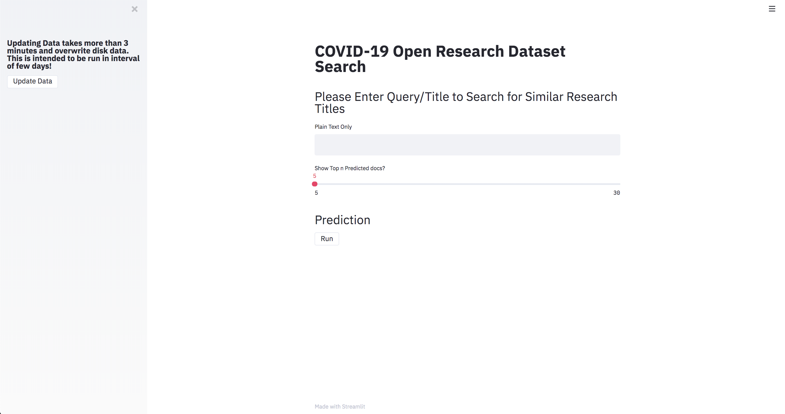
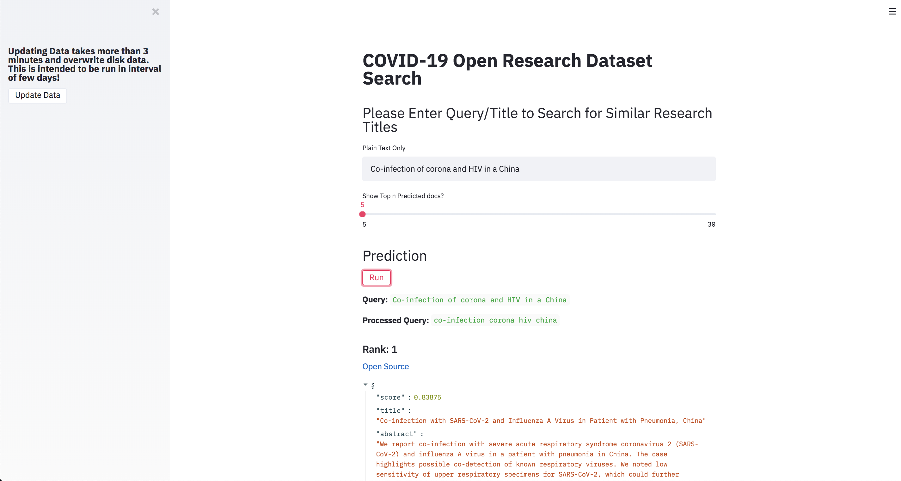
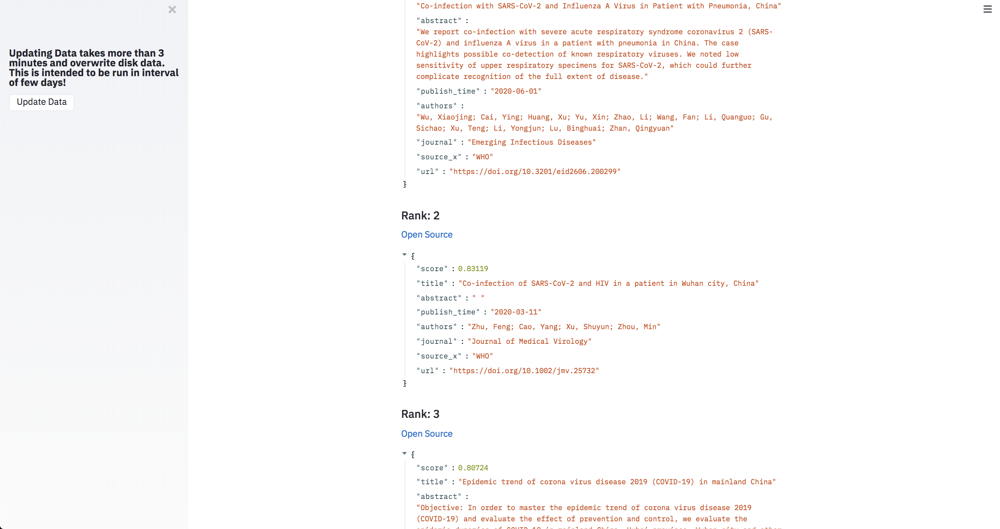

### Covid19
A app to intelligently search through COVID-19 Open Research Dataset (CORD-19)[link](https://pages.semanticscholar.org/coronavirus-research) and find similar papers powered with Machine Learning and NLP. All with a sleek UI.

###### Note: Project Under Development

#### Download Resources
Download the model file `cord19-300d.magnitude (644.95 MB)` form [here](https://www.kaggle.com/davidmezzetti/cord19-fasttext-vectors#cord19-300d.magnitude) and after unzipping keep it in dir `resources` in the root directory.
Note: You will need to login into Kaggle.

For now we will only use the Metadata File from [Semantic Scholar](https://pages.semanticscholar.org/coronavirus-research)

#### DIR structure should look like
```
.
├── LICENSE
├── README.md
├── data (will be created on first upate run from the app)
│   ├── metadata.csv 
|   ├── metadata_processed.pickle
├── resources
│   ├── cord19-300d.magnitude
├── src
│   ├── cord19_app.py
│   ├── config.cfg
│   ├── data_io.py
│   ├── embedding.py
│   ├── tokenizer.py
│   ├── utils.py
│   └── vectorizer.py

... (excluded others)

```

 
#### Running the Streamlit App
```
cd src
streamlit run cord19_app.py
```

**Note: On first run Click on `Update Data` button on sidebar of the app, it will take around 3-5 min, wait for it Then you can run query. This is only required first time and next when you want to update new data from the source.**




